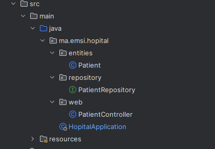
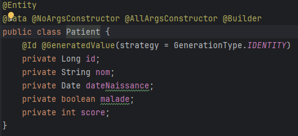
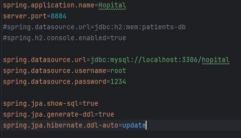
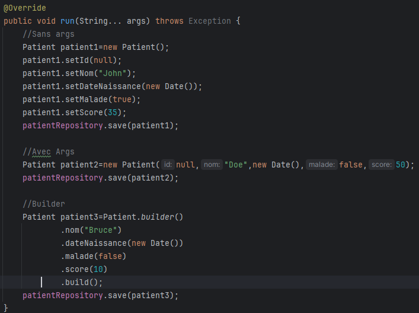
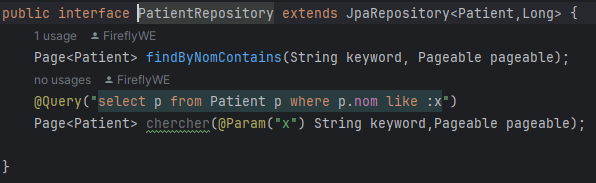
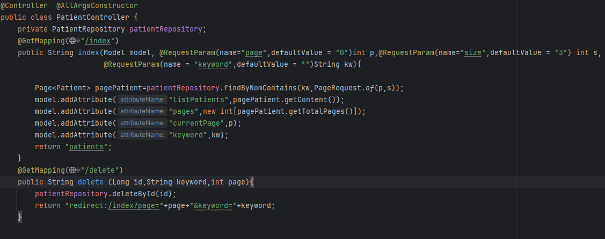

<h1>Compte rendu TP3</h1>

<h2>Architecture du projet</h2>

<h2>classe Patient</h2>

<h2>Properties</h2>

<h2>Ajout</h2>

<h2>Implémentation d'une méthode de recherche par nom</h2>

<h2>Controller Patient</h2>

<h2>Vue patient <i>HTML</i></h2>

